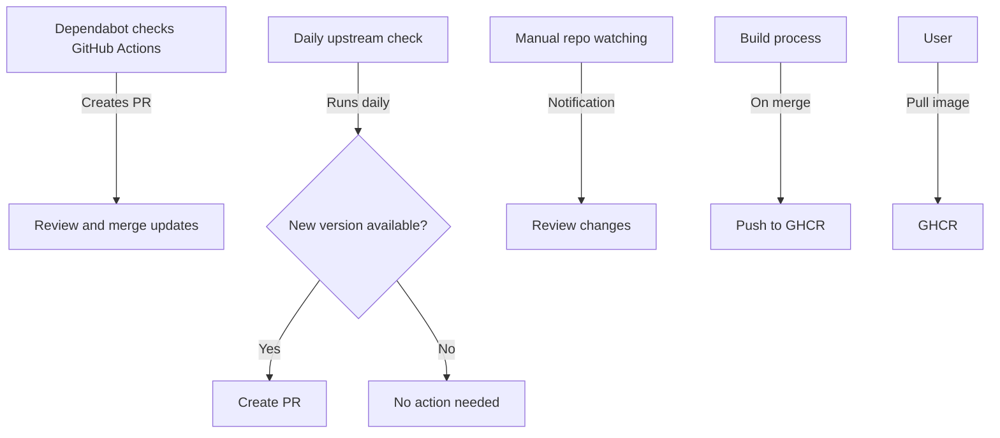

# Packages

## Overview
This repository builds a small set of customized public Docker images and publishes them to GitHub Container Registry.

Key features:
1. Build Docker images from versioned source definitions.
2. Keep per-image platform lists in `.github/image-builds.json`.
3. Tag images according to stable conventions.
4. Push images to `ghcr.io`.
5. Check selected upstream releases and create pull requests.

## Architecture

```mermaid
graph TD
    A[Dependabot checks GitHub Actions] -->|Creates PR| B[Review and merge updates]
    C[Daily upstream check] -->|Runs daily| D{New version available?}
    D -->|Yes| E[Create PR]
    D -->|No| F[No action needed]
    G[Manual repo watching] -->|Notification| H[Review changes]
    I[Build process] -->|On merge| J[Push to GHCR]
    K[User] -->|Pull image| L[GHCR]
```

## Services

### Caddy

Custom Caddy server with additional modules. Tags are published as `latest`, the Caddy major version, and the exact Caddy version. See `caddy/README.md`.

### Katbin

A pastebin service written in Elixir. The app source is tracked as a submodule and the image expects database and mail settings at runtime. See `katbin/README.md`.

### sing-box

Generic sing-box image built from upstream source with the v2ray API build tag enabled. Tags use the `*-v2ray-api` suffix. See `singbox/README.md`.

### Deepnote

Legacy image definitions are still present but intentionally not maintained in this refresh.

## Update Process
1. Daily automatic checks for Caddy releases, sing-box releases, and the Katbin source submodule.
2. Creation of pull requests for changed upstream inputs.
3. Manual review and merge of update PRs after CI passes.
4. Manual production release through the `Release Images` workflow. Published image indexes contain runnable OS/architecture manifests only.
5. Manual GHCR retention cleanup through the `Package Retention` workflow.

## Platform Policy

The build platform list is intentionally configurable per image in `.github/image-builds.json`.

- `linux/amd64` is the default production target.
- `linux/arm64` is the Apple Silicon Docker target.
- Katbin currently builds only `linux/amd64`; add `linux/arm64` to its `platforms` list when an ARM build is needed.

## Usage
This repository is public, but the images are primarily maintained for personal infrastructure. Runtime configuration and secrets are not included in the images.

## License
Each upstream project keeps its own license. This repository only contains build definitions and light packaging glue.
