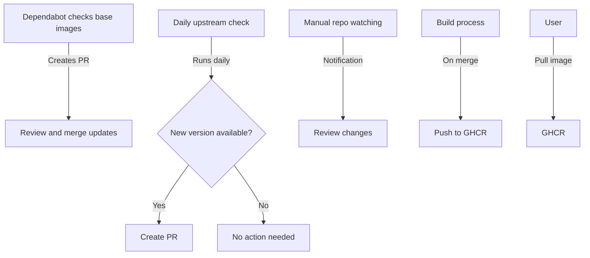

#  Package Manager

## Overview
This repository serves as a versatile package manager tailored for custom needs. It handles multiple services, with Caddy being the first implemented example.

Key features:
1. use Github Actions to build Docker images from customized configurations
2. Tag images according to established conventions
3. Push images to GitHub Container Registry (ghcr.io)
4. Regularly check for upstream updates and create pull requests

Future implementations will include other services, LLM models, and PyPI packages.

## Architecture

## Services

### Caddy
Custom Caddy server with additional modules. See `caddy/README.md` for details.

### Katbin
A pastebin service written in Elixir. See `katbin/README.md` for details. This service is included as a git submodule and built from source.

### [Other Service]
[Brief description of other service. Add as implemented.]

## Update Process
1. Daily automatic checks for upstream updates
2. Creation of pull requests for new versions
3. Manual review and merge of update PRs
4. Automatic build and push of updated images to GHCR

## Usage
> not ready for 3rd party use yet. 

## Contributing
Contributions are welcome! Please read our [CONTRIBUTING.md](CONTRIBUTING.md) for details on our code of conduct and the process for submitting pull requests.

## License
This project is licensed under the MIT License - see the [LICENSE](LICENSE) file for details.